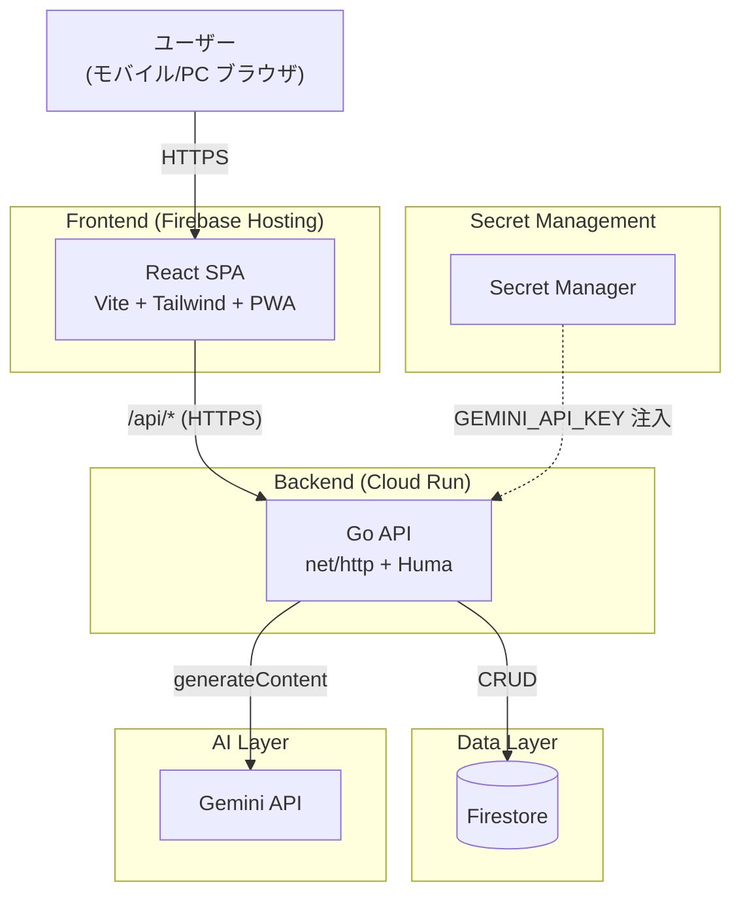
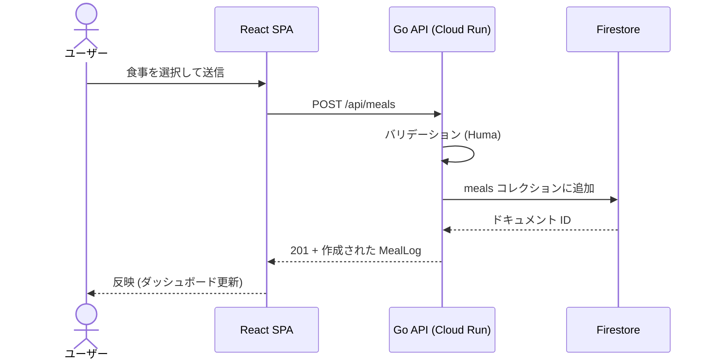
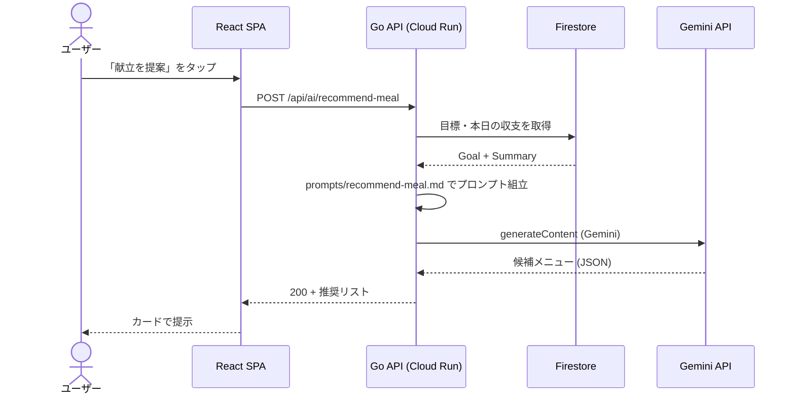
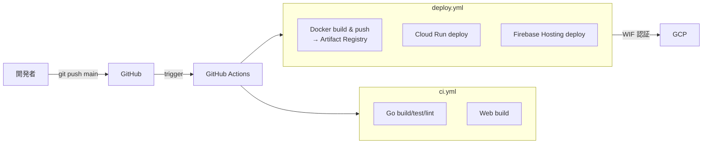

# アーキテクチャ

CUTAGENT のシステム構成と主要データフロー。詳細な要件は [`requirements.md`](requirements.md) を参照。

---

## 1. システム構成図

---

## 2. コンポーネントの責務

| コンポーネント | 責務 | 責務外 |
|---|---|---|
| **web (React SPA)** | UI、ルーティング、状態管理、API クライアント、PWA 機能 | ビジネスロジック、データ整形（集計など） |
| **api (Go + Huma)** | エンドポイント、バリデーション、ビジネスロジック、Firestore アクセス、Gemini 呼び出し、OpenAPI 提供 | UI 関連、ユーザー認証（MVP では未実装） |
| **Firestore** | 永続化（体重・食事・運動・目標）、プリセットマスタ | アプリケーション関心のロジック |
| **Gemini API** | 献立 / ワークアウトのレコメンド生成 | 記録の永続化、業務ルール |
| **Secret Manager** | API キーの保管・配布 | アプリケーションのデータ |
| **Firebase Hosting** | 静的ファイル配信、CDN、HTTPS | API（Cloud Run に転送）|

---

## 3. 主要データフロー

### 3.1 食事を記録する

### 3.2 献立をレコメンドする

---

## 4. デプロイメント

- **認証**: Workload Identity Federation。サービスアカウントキーは保持しない。
- **トリガ**: `main` への push (PR マージ時)。

---

## 5. 非機能特性

| 項目 | 設計 |
|---|---|
| API レイテンシ | コールドスタート 500ms 以内 (Go + distroless の薄いイメージ) |
| AI レスポンス | 10 秒以内目標 (UI 側でローディング表示) |
| スケール | Cloud Run の自動スケール (min 0、max はデフォルト) |
| 可観測性 | Cloud Logging の標準出力ログ (構造化は後続課題) |
| セキュリティ | Gemini API キーは Secret Manager 経由。フロントに露出させない |
| 疎結合 | web と api は OpenAPI 経由のみ。型は OpenAPI から生成 (現状は手書き、課題) |

---

## 6. 将来拡張の方向

要件定義の §13 (将来対応) を実装する際、構成にどう加わるかの目安。

| 拡張 | 追加コンポーネント |
|---|---|
| 自律ループ (日次ペース判定) | Cloud Scheduler + Pub/Sub → Cloud Run (新エンドポイントまたは別サービス) |
| PWA Push 通知 | Firebase Cloud Messaging |
| 写真 → 食事推定 | Gemini multimodal の呼び出しを追加 (新エンドポイント) |
| マルチユーザー | Firebase Auth + Firestore のセキュリティルール |

---

## 関連ドキュメント

- 要件定義: [`docs/requirements.md`](requirements.md)
- API 詳細: [`api/README.md`](../api/README.md)
- Web 詳細: [`web/README.md`](../web/README.md)
- セッション引き継ぎ: [`PLAN.md`](../PLAN.md)
